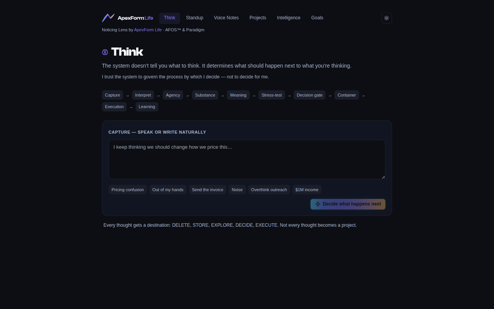
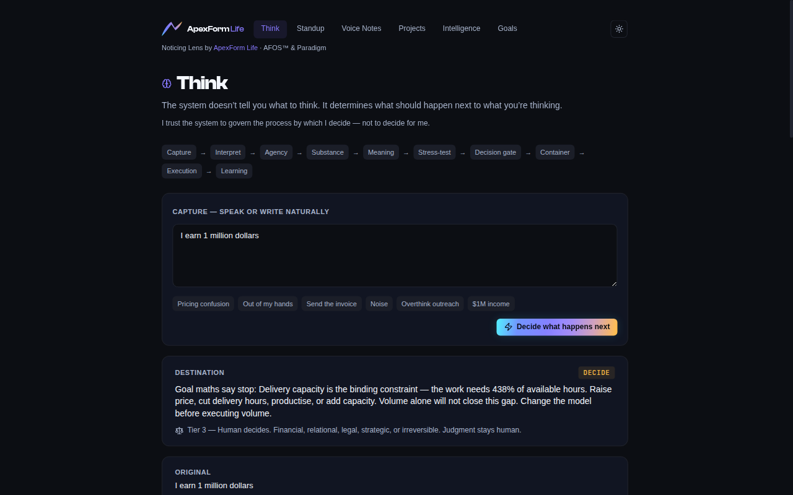
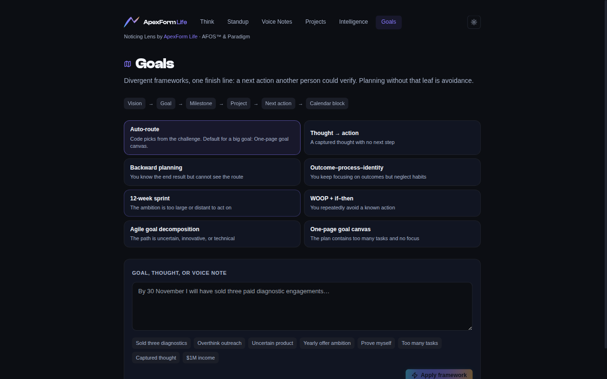
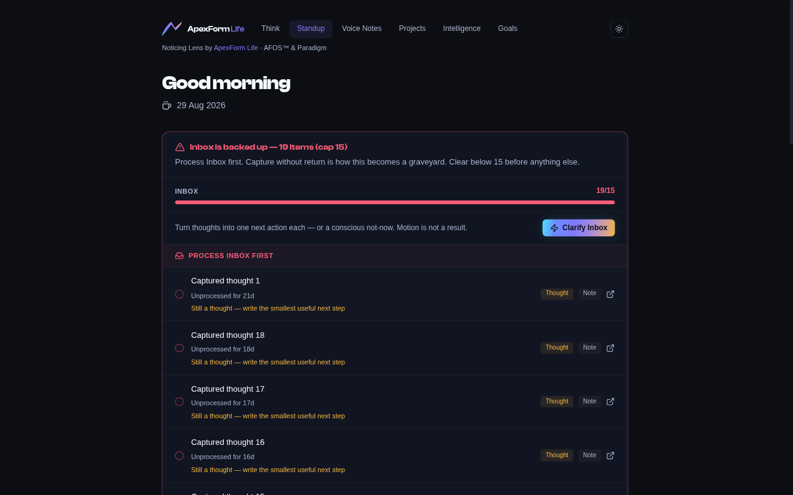

# Using Noticing Lens

Noticing Lens is a **thought operating system**. Capture something. The system assigns a **destination**. It does not hold a conversation.

Start in fixture mode so you can learn the surfaces without Notion:

```bash
RESURFACE_FIXTURE=overflow PORT=5000 npm run dev
```

Open the app. An empty URL lands on Think (`/#/think`). The forty-second proof is live at [lens.apexformlife.com/#/think](https://lens.apexformlife.com/#/think): tap **`$1M this year`**, then **Decide what happens next**. Destination is **DECIDE** — change the model, not more volume.

The **operator** host (Notion Apex Hub) is a different Railway service. Bookmark `/#/standup` for the live inbox. Variable tables: [setup.md](setup.md).

<p align="center">
  
</p>

The lockup is ApexForm Life on purpose. It links to [apexformlife.com](https://apexformlife.com) (AFOS™ and Paradigm). See [TRADEMARKS.md](../TRADEMARKS.md).

Routes are **hash routes** (`/#/think`, not `/think`). Bookmark the hash. Voice notes remain at `/#/`.

---

## Think — `/#/think`

This is the core loop.

1. Type a thought, or pick a sample chip (pricing confusion, invoice send, outreach avoidance, `$1M this year`).
2. Choose **Decide what happens next**.
3. Read the **destination** first: DELETE, STORE, EXPLORE, DECIDE, or EXECUTE.
4. If meanings A / B / C appear, confirm one. The destination can change. The original wording is preserved.
5. If Goal Coach maths **stop** (for example a `$1M` services target that fails capacity), the destination is **DECIDE** — change the model — not more outreach.

<p align="center">
  
</p>

The sequence under the heading (Capture → Interpret → … → Learning) is the process the code governs. You are not chatting with it.

Details: [destinations.md](destinations.md).

---

## Goals — `/#/goals`

Seven frameworks. Every plan must end in a **next action** another person could verify (verb + object, 5–60 minutes). “Write a plan” is rejected.

1. Paste a goal or thought, or use a sample.
2. Accept the recommended framework or pick another. The recommendation is code, not a vibe.
3. Read the canvas. The first action is the leaf. If Goal Coach has named obstacles or a capacity stop, that leaf may be *change the model*.

<p align="center">
  
</p>

---

## Standup — `/#/standup`

Daily resurface. Three buckets, cap **15** items so overflow cannot hide behind “today.”

| Bucket | Meaning |
| --- | --- |
| Inbox | Unfiled captures |
| Today | Doing, due today |
| Stale | Overdue or rotting work |

In fixture `overflow`, inbox is deliberately too large so you can see the graveyard behaviour. `RESURFACE_FIXTURE=healthy` is the calm case.

<p align="center">
  
</p>

**Clarify inbox** turns unfiled thoughts into next-action cards (act or not-now). It does not dump a canvas into Notion.

**Weekly inbox audit** is a different pass. New work lands in Inbox. Then it must be assigned to an existing Project, Goal, or Reason. A date is not a home. If it cannot sit on an existing container: **remove** it (archive — not hard-delete) or **recalibrate** with a new project or goal. Matching is token overlap in code, not a prompt. Confirm each row; nothing writes until you do.

In fixture mode the audit shows a sample Apex Hub Inbox (including dated rows that are still uncontained). Live mode reads your Tasks database via `NOTION_TASKS_DB_ID` and matches against Projects / Goals from env.

---

## Voice notes — `/#/`

Live Notion notes (Type = Voice Note). Fixture mode has no live notes; the chrome and navigation still work. Connect a workspace with [setup.md](setup.md) to see your own captures, extract first actions, and open a note.

---

## Projects — `/#/projects`

Project health from your Projects database: stalled, overdue, completion. Same rule as Voice notes — needs Notion IDs.

---

## Intelligence — `/#/intelligence`

Weekly pattern pass across goals, projects, and recent work. Optional. Canvas text may be filled from a model when a key is set; the weekly habit and the schema are the product. Task classification (Process / Immersive) and note titles are tools on this surface too.

---

## What “good” looks like

- You captured something messy.
- You know whether to drop it, keep it, investigate, choose, or act.
- If you act, the next step is physical and timed.
- If the maths say the goal is impossible as stated, you **decide** — you do not execute harder.

That is the app. Hosted organisation and iOS products are [AFOS™ and Paradigm](https://apexformlife.com).
